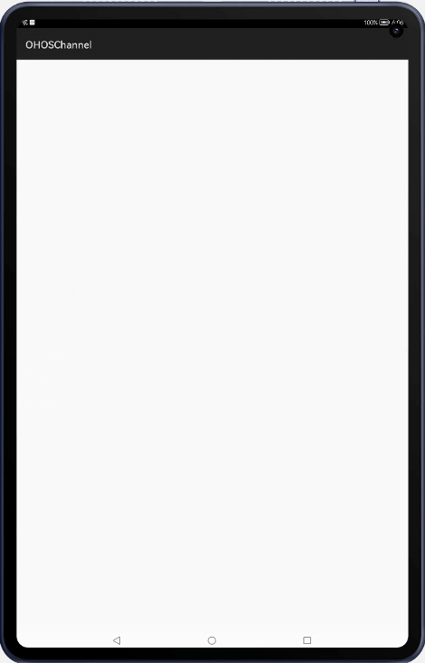

# OHOSChannel

OHOSChannel is helper library for inter thread communication between main thread and worker thread. 

## Source
Inspired by [skyfe79/AndroidChannel](https://github.com/skyfe79/AndroidChannel)

## Feature
This library is helper library for inter thread communication between main thread and worker thread. 
OHOSChannel uses HandlerThread for inter thread communication.





## Dependency
1 . For using ohoschannel module in sample app, include the source code and add the below dependencies in entry/build.gradle to generate hap/support.har.
```groovy
	dependencies {
		implementation project(path: ':ohoschannel')
                implementation fileTree(dir: 'libs', include: ['*.har'])
                testImplementation 'junit:junit:4.13'
	}
```
2 . For using ohoschannel in separate application using har file, add the har file in the entry/libs folder and add the dependencies in entry/build.gradle file.
```groovy
	dependencies {
		implementation fileTree(dir: 'libs', include: ['*.har'])
		testImplementation 'junit:junit:4.13'
	}
```

## Usage

### Ping-Pong 

You can make a channel between main thread and worker thread easily.
```java
channel = new OhosChannel(new OhosChannel.UiCallback() {
    @Override
    public boolean handleUiMessage(InnerEvent msg) {
        if (msg.eventId == PING) {
            HiLog.debug(HI_LOG_LABEL, " PING");
            ohosChannel.toWorker().sendEvent(PONG, 1000);
        }
        return false;
    }
}, new OhosChannel.WorkerCallback() {
    @Override
    public boolean handleWorkerMessage(InnerEvent msg) {
        if (msg.eventId == PONG) {
            HiLog.debug(HI_LOG_LABEL, " PONG");
            ohosChannel.toUi().sendEvent(PING, 1000);
        }
        return false;
    }
});
channel.toUi().sendEvent(PING);
```

### Timer

If you use OHOSChannel, You can make Timer more easily. I already made Timer class for you. You can just use it. If you want to know how to implement Timer class, you just read [souce code](https://github.com/skyfe79/AndroidChannel/blob/master/androidchannel/src/main/java/kr/pe/burt/android/lib/androidchannel/Timer.java) in the package.

```java
timer = new Timer(1000, new Timer.OnTimer() {
    int count = 0;
    @Override
    public void onTime(Timer timer) {
        count++;
        textView.setText("count : " + count);
    }
});
timer.start();	
```

You can also stop the timer like this.
```java
@Override
public boolean onTouchEvent(TouchEvent event) {
    if (event.getAction() == TouchEvent.PRIMARY_POINT_UP) {
        if (timer.isAlive()) {
            timer.stop();
        } else {
            timer.start();
        }
    }
    return super.onTouchEvent(event);
}
```

## APIs

* channel.open()
 * Use open() method to open channel. If you created a channel by Channel constructor, it is automatically open the channel by default. 
* channel.close() 
 * Use close() method to close channel. close() method removes callbacks and messages in the message queue.
* channel.toUI() 
 * toUI() method returns main thread handler. If you want to send messages to ui thread you should use toUI() method.
* channel.toWorker()
 * toWorker() method returns worker thread handler. If you want to send messages to worker thread you should use toWorker() method.  
 
## License
The MIT License

Copyright © 2015 Sungcheol Kim, http://github.com/skyfe79/AndroidChannel

Permission is hereby granted, free of charge, to any person obtaining a copy
of this software and associated documentation files (the "Software"), to deal
in the Software without restriction, including without limitation the rights
to use, copy, modify, merge, publish, distribute, sublicense, and/or sell
copies of the Software, and to permit persons to whom the Software is
furnished to do so, subject to the following conditions:

The above copyright notice and this permission notice shall be included in
all copies or substantial portions of the Software.

THE SOFTWARE IS PROVIDED "AS IS", WITHOUT WARRANTY OF ANY KIND, EXPRESS OR
IMPLIED, INCLUDING BUT NOT LIMITED TO THE WARRANTIES OF MERCHANTABILITY,
FITNESS FOR A PARTICULAR PURPOSE AND NONINFRINGEMENT. IN NO EVENT SHALL THE
AUTHORS OR COPYRIGHT HOLDERS BE LIABLE FOR ANY CLAIM, DAMAGES OR OTHER
LIABILITY, WHETHER IN AN ACTION OF CONTRACT, TORT OR OTHERWISE, ARISING FROM,
OUT OF OR IN CONNECTION WITH THE SOFTWARE OR THE USE OR OTHER DEALINGS IN
THE SOFTWARE.
